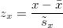

# The Alpine Water balance And Runoff Estimation model (AWARE)

Authors: Kristian Förster, Florian Hanzer

## What is AWARE?
AWARE is a simple deterministic water balance model operating at monthly time steps on a regular grid. It is founded upon the work of McCabe and Markstrom (2007) which combines the Thornthwaite (1948) evapotranspiration formulae and a simple soil water balance model. In addition, AWARE accounts for both snow and ice-melt. The model is written in pure Python and can, thus, easily be integrated in workflows for data analyses. At present, the model is used for seasonal predictions using climate model-based forecasts of anomalies (Förster et al., 2016).

## Prerequisites and installation
As AWARE is a pure Python implementation, it works on every computer with a Python installation (2.7, 3.5). In order to run properly, AWARE requires the following additional Python packages:

* numpy (scientific computing)
* pandas (easy-to-use data structures and data analysis tools)
* munch (Munch is a dictionary that supports attribute-style access, a la JavaScript)
* rasterio (this package is capable of reading and writing geospatial raster datasets)
* netCDF4 (a python/numpy interface to netCDF library)

While numpy and pandas are very popular packages, which are also shipped with, e.g., the [Anaconda distribution](https://www.continuum.io/downloads), the other packages need to be installed using a package manager (pip or conda). The easiest way to getting started is to install Anaconda since it provides pre-compiled binaries of rasterio and netCDF4 for all relevant operating systems. If the AWARE folder from this repository is added to the python path, AWARE can be simply loaded by tyiping

```python
import aware
```

## Scientific description of the model
### Why do we need a new model?
AWARE is a deterministic water balance model. In particular, the representation of processes is conceptual and empirical. In principal it follows the ideas outlined by McCabe and Markstrom (2007). Their model is freely available on the internet and includes a graphical user interface. Even though, this model is an excellent example of modern monthly scale water balance model, it does not include some important features that resulted in initiating the development of AWARE:

* Working with gridded data sets. Vertical hydrological processes are computed for grid cells which might be subject to different terrain characteristics and different meteorological forcing.
* Representation of glaciers. As glaciers strongly influence runoff signatures, an appropriate representation of glacier melt is crucial.
* Interface to large datasets. Nowadays, climate data is typically provided by netCDF data which requires an adequate data interface.

This features were relevant in developing design criteria in the early stage of the software development.

### Meteorological input
As the model operates on a regular grind, the meteorological forcing must be provided as gridded datasets. At present the model is tested using the [HISTALP](http://www.zamg.ac.at/histalp/index.php) data. This dataset includes monthly values of air temperature and precipitation depth since 1800 for the Greater Alpine Region. In principle it is very easy to provide interface to similar datasets like ERA-Interim or CFSR, respectively.

The concept of meteorological input presumes a reference climatology which is typically applied for model calibration (e.g., HISTALP). Other datasets, such as climate model data, can be used as well. Since these models are typically subjected to a climatology that slightly differs from the reference dataset. The monthly time step allows one to work with standardised anomalies (Wilks, 2006):



The standardised anomly *z* of a variable *x* is computed using its long-term average (*x* denoted using the bar symbol) and its respective standard deviation *s*. Given that two datasets are "related, but not strictly comparable" (Wilks, 2006), working with standardised anomalies is feasible. This allows one to transform the climatology of arbitrary climate datasets *y* to a reference climatology *x* by assuming that their standardised anomalies are comparable:


In this way, anomalies of the variable *y* are transformed to the climatological characteristics of $x$. This idea is based on the idea of Marzeion et al. (2012) who applied anomlies of different datasets in order to run a global glacier model.

### Snow and ice-melt
Snow and ice-melt are computed using a temperature-index (day-degree) approach (see, e.g., Rango and Martinec, 1995). This model computes melt rates using temperature only. If radiation data are available, computations based on an enhanced degree day incorporating radiation (Hock, 1999) are also possible. Snow melt is computed by balancing the snow water equivalent which "gains snow" through precipitation below zero degrees. Snowmelt is subtracted from SWE and released as melt outflow which is then inflow to the soil model. Ice-melt is computed for grid cells that are subject to a non-zero glaciated fraction. At present, the ice storage is not limited in the model. However, the glaciated fraction is viewed as transient variable. In this way glacier areas can be updated in regular increments of time.

### Potential evapotranspiration
The potential evapotranspiration ETP computed for each month using the model proposed by Thornthwaite (1948). This model is a very simple model to calculate ETP using temperature data only.

### The soil water balance
The soil water balance is computed in a simplified way. The soil moisture increases if rainfall and snowmelt are greater than zero. The potential evapotranspiration is also utilised as boundary condition. If the ETP exceeds precipitation (and snowmelt) input, the actual evapotranspiration (ETR) is computed using an exponential reduction of ETP. Otherwise, ETR is set to ETR. This means that the water availability enables evapotranspiration rates that equal maximum possible rates under the current meteorological conditions. If the increase in soil moisture storage (i.e. initial storage + input from rain and snow - evapotranspiration) exceed the capacity of the soil moisture storage, a surplus is computed using this difference. The surplus is assumed to contribute to groundwater recharge forming a slow runoff component. In contrast, direct runoff is computed using the well-known runoff coefficient. The soil water balance is a central component of the model (see, Fig. 1).


*Fig. 1: Representation of processes for each grid cell in the AWARE model.*

### Groundwater
AWARE assumes that groundwater can be simply represented by a linear storage. This linear storage requires specifying a storage coefficient *k* which might be seen as the average time in which water travel through this idealised storage.

### Runoff
Runoff is computed by superposing direct runoff from the soil model and the groundwater recession computed by the groundwater model. It is assumed that the time of concentration is smaller than the model time step of one month which is why a routing description is not available (yet). For Alpine catchments, this simplification is assumed to be feasible.

### Model Parameters
This a list of parameters that need to be specified in order to run the model. For each parameter an example is provied.

```python
params = dict(
     default=dict(
        latitude = 47.,
        temp_lapse_rates   = [-0.0026, -0.0035, -0.0047, -0.0053, -0.0052, -0.0053, -0.0049, -0.0047, -0.0042, -0.0033, -0.0035, -0.0031], # temperature increase in C/m
        precip_lapse_rates = [0.042] * 12, # precipitation increase rates in %/m
        ddf_snow         = 85.0,   # degree-day factor for snow
        ddf_ice          = 270.0,       # degree-day factor for ice
        melt_temp        = 273.15,   # melt temperature
        trans_temp       = 273.15,   # temperature separating rain and snow
        temp_trans_range = 1.,       # temperature mixed phase transition range
        gw_n             = 0.2,      # fraction of water that infiltrates into the groundwater storage (if no soil model is applied)
        gw_k             = 7.0,      # groundwater recession constant
        gw_storage_init  = 150.,
        soil_capacity    = 250,       # maximum soil moisture capacity of the soil
        psi              = 0.19,     # runoff coefficient (fraction of runoff that is transformed to direct runoff)
        percolation_f    = 0.4,      # fraction of soil moisture surplus that infiltrates into the groundwater storage
        percolation_r    = 0.2,      # fraction of soil moisture that is subjected to percolation
        sms_init         = 90.,
        et_j             = 16.819,
        factor_etp_summer= 1.0,
        rain_corr        = 1.05,
        snow_corr        = 1.10,
    ),
    catchments={},
)
```

## References
Auer, I., Böhm, R., Jurkovic, A., Lipa, W., Orlik, A., Potzmann, R., Schöner, W., Ungersböck, M., Matulla, C., Briffa, K., Jones, P., Efthymi- adis, D., Brunetti, M., Nanni, T., Maugeri, M., Mercalli, L., Mestre, O., Moisselin, J.-M., Begert, M., Müller-Westermeier, G., Kveton, V., Bochnicek, O., Stastny, P., Lapin, M., Szalai, S., Szentimrey, T., Cegnar, T., Dolinar, M., Gajic-Capka, M., Zaninovic, K., Majstorovic, Z., and Nieplova, E.: HISTALP—historical instrumental climatological surface time series of the Greater Alpine Region, *Int. J. Climatol.*, 27, 17–46, [doi:10.1002/joc.1377](http://dx.doi.org/10.1002/joc.1377), 2007.

Chimani, B., Matulla, C., Böhm, R., and Hofstätter, M.: A new high resolution absolute temperature grid for the Greater Alpine Region back to 1780, *Int. J. Climatol.*, 33, 2129–2141, [doi:10.1002/joc.3574](http://dx.doi.org/10.1002/joc.3574), 2013.

Förster, K., Oesterle, F., Hanzer, F., Schöber, J., Huttenlau, M., and Strasser, U.: A snow and ice melt seasonal prediction modelling system for Alpine reservoirs, *Proc. Int. Assoc. Hydrol. Sci.*, 374, 143–150, [doi:10.5194/piahs-374-143-2016](http://dx.doi.org/10.5194/piahs-374-143-2016), 2016.

Hock, R.: A distributed temperature-index ice- and snowmelt model including potential direct solar radiation, *J. Glaciol.*, 45, 101– 111, 1999.

Marzeion, B., Jarosch, A. H., and Hofer, M.: Past and future sea-level change from the surface mass balance of glaciers, *Cryosphere*, 6, 1295–1322, [doi:10.5194/tc-6-1295-2012](http://dx.doi.org/10.5194/tc-6-1295-2012), 2012.

McCabe, G. J. and Markstrom, S. L.: A Monthly Water-Balance Model Driven By a Graphical User Interface, *U.S. Geological Survey Open-File report*, [https://pubs.usgs.gov/of/2007/1088/](https://pubs.usgs.gov/of/2007/1088/), accessed on 22 Feb 2017, 2007.

Rango, A. and Martinec, J.: Revisting the degree-day method for snowmelt computations, *J. Am. Water Resour. Assoc.*, 31, 657– 669, [doi:doi:10.1111/j.1752-1688.1995.tb03392.x](http://dx.doi.org/doi:10.1111/j.1752-1688.1995.tb03392.x), 1995.

Thornthwaite, C. W.: An Approach toward a Rational Classification of Climate, *Geogr. Rev.*, 38, 55–94, [doi:10.2307/210739](http://dx.doi.org/10.2307/210739), 1948.

Wilks, D. S.: Statistical methods in the atmospheric sciences, no. 91 in International Geophysics Series, Academic Press, Amsterdam, Boston, 2nd edn., 2006.
